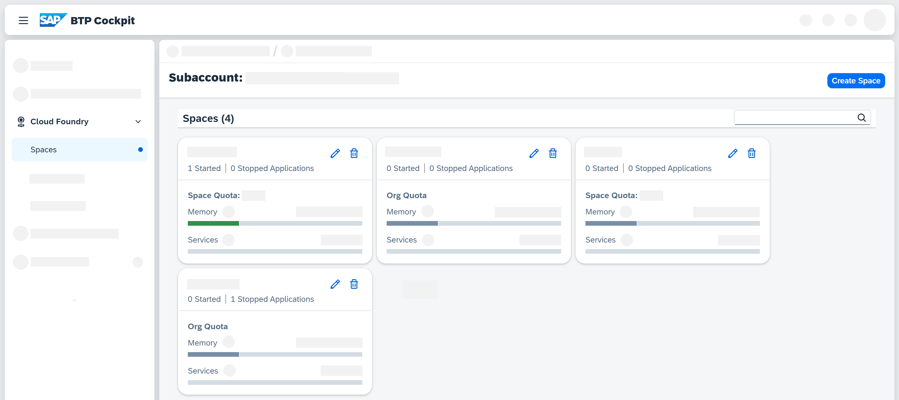

<!-- loio5209d55d8dd84228897112b0655d999b -->

<link rel="stylesheet" type="text/css" href="../css/sap-icons.css"/>

# Managing Spaces

Learn what a Cloud Foundry space is, what type of information you will find on the *Spaces* page in the SAP BTP cockpit, and what you can do with or within a space.

<a name="loio5209d55d8dd84228897112b0655d999b__section_ib5_prc_1bc"/>

## What Is a Space?

A space is a shared location on the platform in which you can deploy and maintain applications, and connect them to services. You can create multiple spaces within one org. There is no limit to how many spaces you can have in a single org.

By default, a space inherits the org quota. If you don't want your space to consume the entire org quota, you can use space quota instead. For more information, see [Managing Space Quotas](managing-space-quotas-4e5f0ee.md).

<a name="loio5209d55d8dd84228897112b0655d999b__section_sm3_bsx_dbc"/>

## Prerequisites

If you want to see any spaces on the *Spaces* page in the cockpit, you must have either the Org Manager role or any one of the space roles.

The Org Manager role gives you access to all spaces in an org. A space role gives you access to a specific space.

For more information, see [About Roles in the Cloud Foundry Environment](about-roles-in-the-cloud-foundry-environment-0907638.md).

<a name="loio5209d55d8dd84228897112b0655d999b__section_wm2_5tr_bbc"/>

## What Can You Find on the Spaces Page?

To visit this page in the cockpit:

1.  Navigate to a subaccount of your choice.

2.  Navigate to the *Cloud Foundry* \> *Spaces* page.

You find the following on this page:

-   A list of all spaces you have access to.

-   Details about each space tile, such as:

    -   Number of started and stopped applications in a space

    -   Name of the space quota if a space quota is assigned to the space, or *Org Quota* if the space is currently using the org quota

        To manage these settings, navigate to *Cloud Foundry* \> *Space Quotas* \> *Quota Assignments*. For more information, see [Assign Space Quotas to Spaces](assign-space-quotas-to-spaces-13028c4.md) and [Edit Space Quotas](edit-space-quotas-2a58364.md).

    -   Available resources such as memory and services with their upper consumption limit and current usage statuses

<a name="loio5209d55d8dd84228897112b0655d999b__section_bpz_nrc_1bc"/>

## What Can You Do With or Within a Space?

Here are some of the space-related actions you can do:

-   [Create Spaces](create-spaces-2f6ed22.md)

-   [Add Space Members](add-space-members-81d0b4d.md)

-   [Deploy an Application](deploy-an-application-09fdb9b.md)

-   Edit Spaces

    To edit a space, choose :pencil2:

    Org Managers and Space Managers are allowed to rename spaces.

-   [Delete Spaces](delete-spaces-1eb6a09.md)

**Related Information**  

[Org Administration Using the Cockpit](org-administration-using-the-cockpit-c4c25cc.md "In the Cloud Foundry enviroment, manage orgs, spaces and space quota plans using the SAP BTP cockpit.")

[Org Administration Using the Cloud Foundry CLI](org-administration-using-the-cloud-foundry-cli-927377f.md "Use the Cloud Foundry command line interface (CF CLI) for managing subaccounts in the Cloud Foundry environment, such as creating orgs and spaces, or managing quota.")

